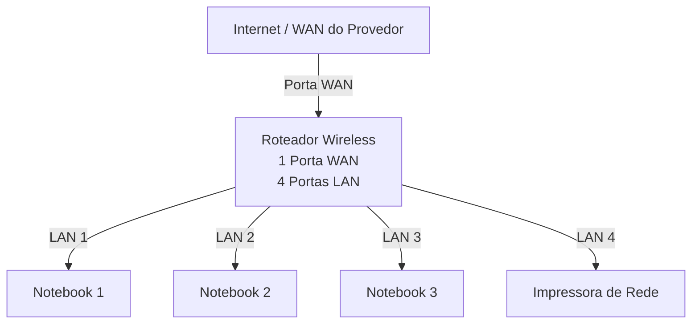
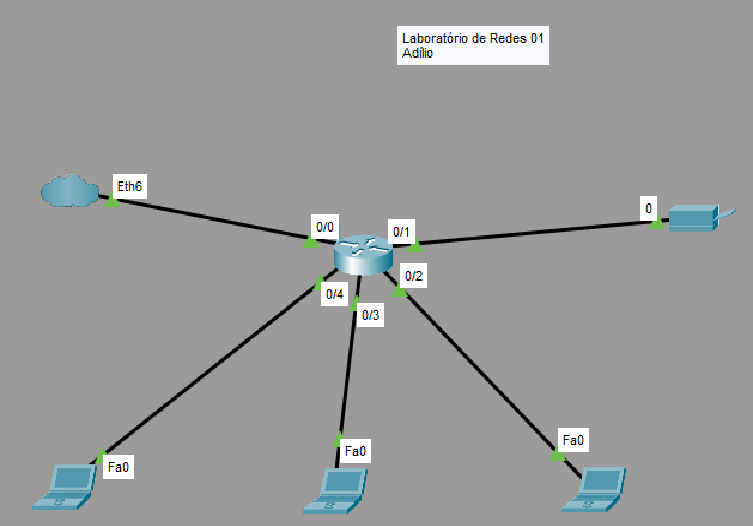

# Laboratório de Redes 01 - Projeto de Rede local

Aluno: Adílio

Professor: José de Assis

Data: 09/03/2026

---

## 1. objetivo
Implementar uma rede local simples conectando 3 notebooks a um roteador wireless com switch e uma impressora de rede.

O projeto será dividido em dua etapas:

1. Simulação da rede no Cisco Packet Tracer
2.  Implementando da rede no laboratório real

...

## 2. equipamentos utilizados neste laboratório 

- 3 notebooks
- 1 roteador wireless com 1 porta WAN e 4 portas LAN
- 1 impressora de rede
- cabos de rede

---

## 3. Topologia da Rede

Diagrama lógico da rede usada neste laboratório.

Imagen da topologia-usada neste laboratório:

.

# lab-redes-01

## 4. Plano de endereçamento IP

Rede: 192.168.0.0/24

Gatway: 192.168.0.1

| Dispositivo | Tipo de IP | Endereço IP | Observação |
| -------------|-------------|-------------|-------------|
| Roteador | Estático | 192.168.0.1 | IP do roteador |
| impressora | Reserva DHCP | 192.168.0.101 | IP reservado pelo roteador |
| PC1 | Reserva DHCP | 192.168.0.102 | IP reservado pelo roteador |
| PC2 | DHCP | Automático | IP atribuído pelo roteador |
| PC3 | DHCP | Automático | IP atribuído pelo roteador |

**Observação**

- A impresspra e um dos notebooks utlizam reserva DHCP.
- O roteador sempre atribui o mesmo endereço IP a esses dispositivos.

- 

## 5. Implementação do laboratório real

Após a instalação, a rede foi montada fisicamente no laboratório

Etapas realizadas:

(fotos e capturas de tela realizadas durante o laboratório)

Testes:

(fotos e capturas de tela realizadas durante o laboratório)

---

## 6. Conclusão

Este laboratório permitiu compreender o funcionamento de um rede local simples, incluindo:

- Estrutura de um rede doméstica ou de pequeno escritório
- Utilização de um roteador com porta WAn e portas LAN
- Funcionamento do DHCP
- Comunicação entre dispositivos na rede local
- Compartilhamento de pasta na rede usando o Windows
- Jogos em rede
